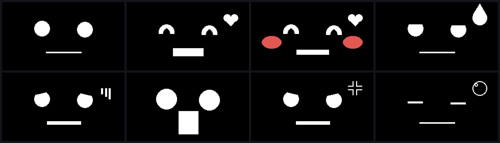

# stickchan

**M5Stack StickS3 が、スタックチャンの顔になります。**

UiFlow2（MicroPython）の上で動きます。ファームウェアを書き換えません。
ファイルを3つ置くだけで、電源を入れると顔が出ます。



呼吸し、まばたきし、傾けると目がそちらを向きます。乱暴に振ると目を回します。
放っておくとあくびをして、うとうとして、寝ます。画面を伏せても寝ます。
電池が減ると動きが重くなります。長く寝たあとに起こすと喜びます。

---

## 必要なもの

- **M5Stack StickS3**（ESP32-S3-PICO-1 / 画面 135x240 / フラッシュ 8MB / PSRAM あり）
- 出荷時の **UiFlow2**（MicroPython v1.27 で確認）
- Mac / Linux と USB-C ケーブル（**データ通信対応のもの**）
- ホスト側に Python 3 と `pyserial`

他の M5 機種でも、M5Unified が対応していて画面があれば動く可能性がありますが、
**確認したのは StickS3 だけ**です。

## 入れかた

```bash
git clone https://github.com/kou-uni/stickchan
cd stickchan
pip install pyserial

# 実機のポートを確認（例: /dev/cu.usbmodem83201）
ls /dev/cu.usbmodem*

P=/dev/cu.usbmodem83201
python3 tools/repl.py --port $P --put face.py /flash/face.py
python3 tools/repl.py --port $P --put boot.py /flash/boot.py
python3 tools/repl.py --port $P --put main.py /flash/main.py

# UiFlow2 のスタートアップメニューを飛ばして main.py を直接実行させる
python3 tools/repl.py --port $P --exec "
import esp32
nvs = esp32.NVS('uiflow'); nvs.set_u8('boot_option', 0); nvs.commit()
print(nvs.get_u8('boot_option'))"
```

再起動すると顔が出ます。

### 元に戻す

**正面の青いボタンを押しながら起動**してください。顔は起動せず、
UiFlow2 のスタートアップメニューに戻ります。`boot.py` が用意している逃げ道で、
このプロジェクトもそこに相乗りしています。顔が壊れても閉じ込められません。

REPL からでも戻せます。

```bash
python3 tools/repl.py --port $P --exec "
import esp32
nvs = esp32.NVS('uiflow'); nvs.set_u8('boot_option', 1); nvs.commit()"
```

> **なぜ `boot.py` に入れるのか。**
> `main.py` に置くと消えます。`boot_option` が 1 に戻ると UiFlow2 が
> `sync.run()` を実行し、クラウド側の内容で `main.py` が置き換わります。
> `boot.py` の末尾にも `main.py` を上書きする処理があります。
> 実際に外出中に消えて顔が出なくなりました。`main.py` は UiFlow2 の持ち物です。

## 操作

| 操作 | 起きること |
|---|---|
| **青 シングル** | 寝ていれば起こす。起きていれば**喜ぶ** |
| **青 ダブル** | **固定モード**の入切（固定中は消灯しない。右下に白い点） |
| **青 長押し** | **音の入切**（左下にアイコンが0.8秒出る） |
| **右 シングル** | 表情を巡回（8種） |
| **右 ダブル** | **恥ずかしがる** |
| **右 長押し** | **押している間だけ声を聞いて口が動く**（左上に赤い点） |

触らなくても反応します。

| きっかけ | 反応 |
|---|---|
| 傾ける | 目がそちらへ寄る。**遅れて追いつく** |
| 速く振る | **目を回す**（ジャイロ 320 deg/s 以上） |
| 画面を伏せる | 1.2秒で寝る。戻すと起きる |
| 3分放置 | 6割で**あくび** → 8.5割で**うとうと** → 満了で**暗転** |
| 電池 25% 未満 | まばたきが重くなり、早く眠くなる |
| 30分以上寝たあと | 起こされると**喜ぶ** |

### 調整

走らせたまま変えられます。

```bash
python3 tools/repl.py --port $P --exec "
import face
f = face._face
f.eye_r = 18          # 目の大きさ
f.breath_px = 2       # 呼吸の振れ幅
f.gaze_px = 14        # 視線の振れ幅
f.gaze_lag = 0.08     # 小さいほど遅れて動く
f.shake_dps = 250     # 振り判定のしきい値
f.idle_timeout_ms = 60000
f.render()"
```

## 開発

### 実機を見ずに顔を確認する

`tools/sim.py` は `M5.Lcd` を PIL に差し替えて **`face.py` をそのまま読み込み**、
PNG に描き出します。移植版を別に書くと本物とずれるので、描画コードは1本です。

```bash
python3 tools/sim.py idle happy embarrassed surprised
# → out/sim_*.png
```

### まばたきと呼吸が顔を壊していないか

```bash
python3 tools/check_blink.py
```

不変条件はひとつ。**まばたきと呼吸を1周して戻ったら、描き直した顔と
1ピクセルも違わない。**

> この検査は最初「目の周りは除外して比べる」と書いてバグを見落としかけました。
> 壊れるのは**まさに目の消し枠が口に届く境目**で、そこは除外範囲の中に入ります。
> 除外なしの全画素比較にしてあります。

### 実機とやりとりする

```bash
python3 tools/repl.py --port $P --exec "print(1+1)"
python3 tools/repl.py --port $P --put  local.py /flash/remote.py
python3 tools/repl.py --port $P --get  /flash/battery.csv out/battery.csv
```

`--get` は base64 で運びます。`print` で吐かせると paste mode のエコーが混ざり、
**取り出したファイルが壊れます**（実際に壊れたファイルを実機に書き戻して
起動不能にしました）。

## この機種について実測したこと

他の人の役に立つかもしれないので置いておきます。すべて実機で確認した値です。

| | |
|---|---|
| 画面 | 135x240（`setRotation(1)` で 240x135） |
| ボタン | 正面の青 = `BtnA` / 右側 = `BtnB` / 左側 = リセット |
| **タッチパネル** | **無い**（`Touch.getCount()` は常に 0） |
| **明るさ・近接センサ** | **無い**（`Als` は値を返すが実体なし） |
| **RGB LED** | **無い**（`Led.getCount()` が 0） |
| IMU | あり。静止時のノイズ ±0.01G |
| スピーカー | あり。`tone()` は非同期で1msで戻る |
| マイク | あり。**`begin()` 直後の数発はゴミ**（RMS 25904 が出た） |
| **電池の消費電流** | **読めない**（`getBatteryCurrent()` は常に 0mA） |
| `isCharging()` | **信用できない**。90秒で True/False をランダムに往復した |
| 残量 % | 電圧からの推定。±12mV のノイズがあり数%揺れる |
| キャンバス転送 | 240x135 16bpp の `push()` が **14.5ms**（最大59fps） |

### スピーカーとマイクは同居できない

I2S を共有しています。マイクを使う前に `M5.Speaker.end()`、
終わったら `M5.Mic.end()` してから `M5.Speaker.begin()` が要ります。

### マイクは押している間しか回さない

常時録音にすると電池を食ううえ、**周囲の会話を拾い続ける**ことになります。
押している間だけ録り、その間は画面に赤い点を出します。
**録っていることが見えない録音は作らない**という方針です。

### 描画はキャンバス経由

最初は画面に直接描き、動かす部分だけ黒で消してから描き直していました。
呼吸を入れた途端に**消えている瞬間が見えてチラつきました**。
いまは裏で1枚まるごと描いてから転送します。

副産物として、**「消し枠が足りずに口や頬を食う」系のバグが構造ごと消えました**。
`surprised`（目が1.35倍 + 口が縦47px）と `embarrassed`（頬の赤み）で
実際に起きていた不具合です。

### 「前回会ってから」は測れない

RTC はありますが、電源を切ると 1970年に戻ります。
なので**寝ていた時間**を見ています。鞄の中で何時間も寝て取り出されるのが
実際の場面で、その間は通電したままなので正確に測れます。

## ライセンス

MIT License。

**顔の形は [m5stack-avatar](https://github.com/meganetaaan/m5stack-avatar)（MIT /
Shinya Ishikawa）からの移植**で、`boot.py` は M5Stack の UiFlow2 のファイル（MIT）に
追記したものです。それぞれの著作権表示は [THIRD-PARTY.md](THIRD-PARTY.md) にあります。
